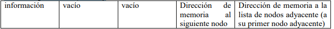
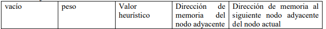

# Métodos de búsqueda no informada e informada (heurística)
## Generalidades

Desarrollar un programa gráfico que permita mostrar y recorrer (de diversas maneras) un grafo que represente el mapa de ubicación de los edificios, canchas, estacionamientos y cafeterías del ITCG, para ello utilizar listas enlazadas preferentemente.

Se van a necesitar dos listas, una para guardar la información (estados), y otra lista para guardar las adyacencias de cada nodo (lista de adyacencia), en esta segunda lista, en lo referente a la información de los nodos se guardará el peso de cada nodo, así como su valor heurísticos, en caso de no tener peso, se asignará por definición el valor de 1, y para el caso de no tener valor heurístico se almacenará el valor de 0 (cero), por lo que es conveniente antes de crear el grafo verificar el peso del grafo, la heurística se calculará en tiempo de ejecución de acuerdo al algoritmo de búsqueda seleccionado y del estado inicial y final que se haya seleccionado.

## La estructura de los nodos será la siguiente:

### *Lista de información (estados)*


### *Lista de información (estados)*


El programa presentará un menú (o lista de opciones de acuerdo a los métodos de búsqueda que se ofrecerá para encontrar una solución dada), así como la opción para seleccionar el punto de inicio y punto final de la búsqueda, deberá mostrar la solución encontrada y el coste en caso de que el algoritmo seleccionado haya sido de tipo informado (no olvidar que es gráfico).

## Los algoritmos de búsqueda a utilizar para encontrar la solución serán:

1. **Búsqueda primero en anchura**
2. **Búsqueda primero en profundidad**
3. **Búsqueda primero el mejor** (búsqueda voraz o avariciosa)
4. **Algoritmo de Dijkstra**
5. **Búsqueda heurística A***
6. **Búsqueda local**, para este caso seleccionar cualquiera de los algoritmos siguientes, solo van a programar uno de estos, el que ustedes decidan:
   - **Búsqueda Tabú**
   - **Hill Climbing**
   - **Branch & Bound**
   - **Simulated annealing**
   - **Clarke & Wright**
   - **Cualquier otro que sea de búsqueda local y heurístico**

---

## 📁 **Estructura del proyecto**

```
/metodos                # Carpeta del proyecto Django con la lógica principal
/venv                   # Entorno virtual
.gitignore              # Archivos y carpetas ignorados por Git
README.md               # Documentación del proyecto
requirements.txt        # Lista de dependencias necesarias
```

---

## ⚙️ **Configuración inicial**

### 1️⃣ **Clonar el repositorio**

Comienza clonando el repositorio desde GitHub:

```bash
git clone <URL_DEL_REPOSITORIO>
cd metodos
```

---

## 💻 **Crear y activar el entorno virtual**

1. Crea un entorno virtual:
```bash
# Windows
python -m venv venv

# Linux / Mac
python3 -m venv venv
```

2. Activa el entorno virtual:
```bash
# Windows
venv\Scripts\activate

# Linux / Mac
source venv/bin/activate
```

---

## 🔧 **Instalar las dependencias**

Instala todas las librerías necesarias utilizando el archivo `requirements.txt`:

```bash
pip install -r requirements.txt
```

---

## 🚀 **Ejecutar el servidor Django**

1. Realiza las migraciones necesarias:
```bash
python manage.py makemigrations
python manage.py migrate
```

2. Inicia el servidor:
```bash
python manage.py runserver
```

El servidor estará disponible en: [http://127.0.0.1:8000](http://127.0.0.1:8000)

---

## 🔥 **Comandos útiles**

- Ver las rutas disponibles:
```bash
python manage.py show_urls
```

---

## 🛠️ **Dependencias principales**

Este proyecto utiliza las siguientes librerías:

- **Django**: Framework principal para la creación del servidor.
- **Django REST Framework (DRF)**: Para la creación de APIs RESTful.
- **SQLite**: Base de datos ligera utilizada en el desarrollo.

